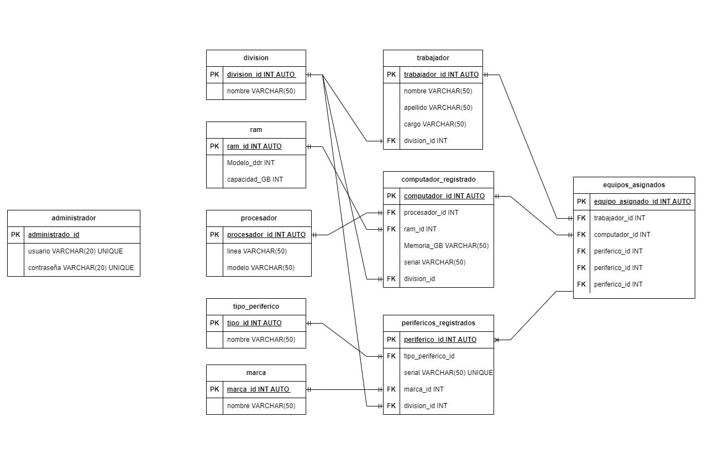

# SISTEMA DE INVENTARIO INCES 

## listado de entidades

### administrador **(ED)**
- administrador_id
- usuario
- contraseña

### equipos_asignados
- equipo_asignado_id 
- trabajador_id
- computador_id
- periferico_id
- periferico_id
- periferico_id

###  trabajador **(ED)**
- trabajador_id 
- nombre
- apellido
- cargo
- division_id 

### Division **(EC)**
- division_id
- nombre

### perifericos_registrados **(EP)**
- periferico_id
- tipo_periferico_id
- serial
- marca_id 
- division_id

### computador_registrado **(EP)**
- computador_id 
- procesador_id
- ram_id
- Memoria_GB
- serial

### tipo de perifericos **(EC)**
- tipo_id
- nombre 

### marcas de perifericos **(EC)**
- marca_id
- nombre

### ram **(EC)**
- ram_id
- modelo_Ddr
- capacidad

### procesador **(EC)**
- procesador_id
- modelo 

## Diagramas

### Modelo Entidad - Relacion 

